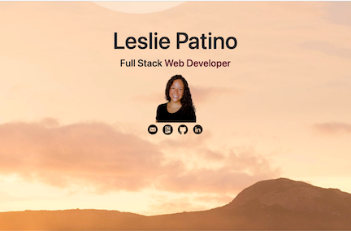

# Leslie Patino | Full Stack Web Developer

[Welcome to my portfolio!](https://lesliejpatino.github.io/LesliePatino_Portfolio/) As you explore it you'll find the most recent projects I've created, as well as my current skill set, resume, and contact information.

# Demo
[Visit Leslie's Portfolio](https://lesliejpatino.github.io/LesliePatino_Portfolio/)
 

# Technologies Used

* [HTML](https://developer.mozilla.org/en-US/docs/Web/HTML)
* [CSS](https://developer.mozilla.org/en-US/docs/Web/CSS)
* [Bootstrap](https://getbootstrap.com/docs/5.0/getting-started/introduction/)
* [AOS](https://michalsnik.github.io/aos/)

# Author

**[Leslie Patino](https://lesliejpatino.github.io/LesliePatino_Portfolio/)**

* [Leslie's GitHub](https://github.com/lesliejpatino)
* [Leslie's LinkedIn](https://www.linkedin.com/in/lesliejpatino/)

## License

MIT License

MIT License

Copyright (c) 2022 Leslie Patino
